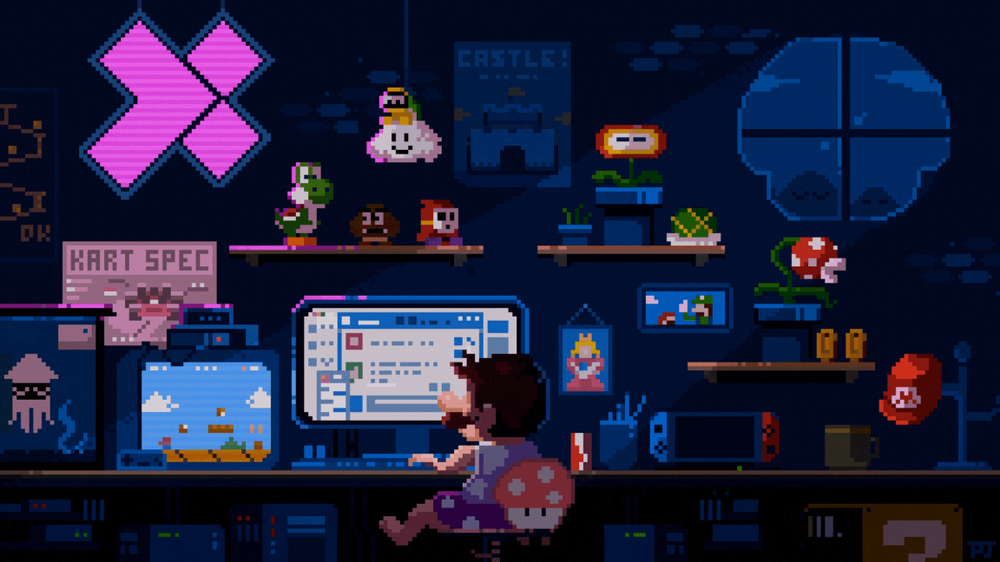

  

### 
🌐 Visit my <a href="https://alnickdev.netlify.app/" target="_blank">Portfolio Website</a>

---

<h2 align="left">🌐 Socials</h2>

  
  
  
  
  

<h2 align="left">👋🏼 Reach me</h2>

  

<h2 align="left">👨‍💻 Current Status Quo</h2>

• 💻 4th Year BSIT Student • 🔍 I'm looking for connection in Full Stack Web Development and Software Engineering Industry • ☁️ Feel free to talk with me about Web Development, Software Engineering and Gaming topics

<h2 align="left">🖥️ Tech Stack</h2>

  
  
  
  
  
  
  
  
  
  
  
  

<h2 align="left">Development Environtment</h2>

  
  
  
  
  
  

<h2 align="left">Profile Visits</h2>

  

